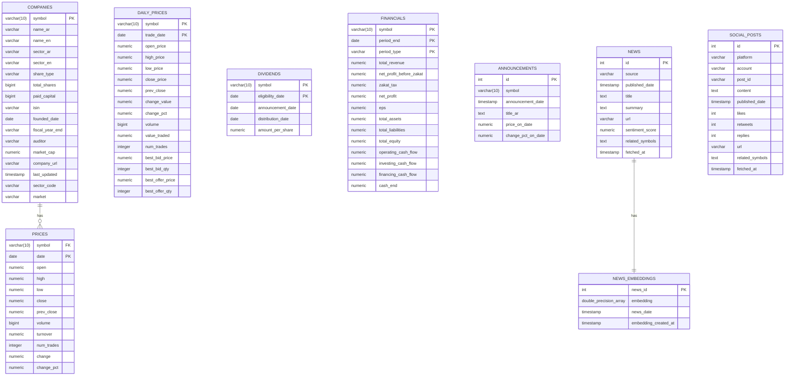

## Saudi Stocks Database – Entity Relationship Overview
The `companies` table is the core entity in the database, serving as the central reference for all listed symbols.  
The `prices` table (190,248 rows) stores historical market data and is the only table currently enforced with a foreign key to `companies`.  
Other tables like `financials`, `dividends`, `announcements`, `news`, and `social_posts` extend the model with fundamentals and sentiment data, forming a solid foundation for market analytics.

